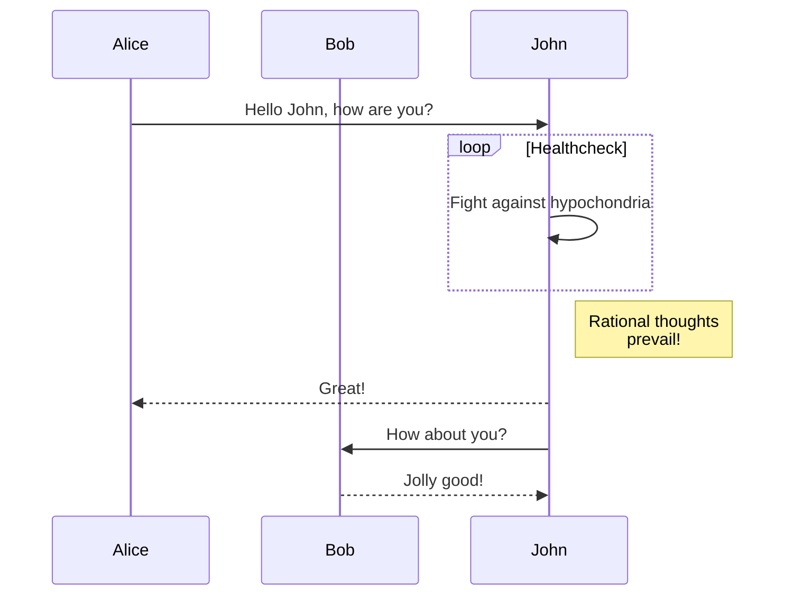

+++
date = '2025-09-17T19:18:20+07:00'
draft = false
title = 'Just Testing'
+++

Just Testing is the name of a [Culture spacecraft](https://theculture.fandom.com/wiki/List_of_spacecraft) in [Iain M. Banks](https://en.wikipedia.org/wiki/Iain_Banks)'s "[Use of Weapons](https://en.wikipedia.org/wiki/Use_of_Weapons)", one of his [Culture series](https://en.wikipedia.org/wiki/Culture_series) novels.

But that is not what this post is about.

This is just me testing [Hugo](https://gohugo.io) with [Blog Awesome Theme]([Theme](https://github.com/hugo-sid/hugo-blog-awesome)). I will probably continue updating this as I go along.

## Useful Links

* [Front matter](https://gohugo.io/content-management/front-matter/)

## Example Quote

> “In Buffett’s view, if you cannot write it down, you have not thought it through.” 
> 
> ― Tren Griffin, Charlie Munger: The Complete Investor

## Example Code Block

```c#
try
{
    Log.Debug("Starting app");
    return commandApp.Run(args);
}
catch (Exception ex)
{
    Log.Error(ex, "An error occurred");
    AnsiConsole.WriteException(ex, ExceptionFormats.ShortenEverything);
    return 1;
}
finally
{
    Log.CloseAndFlush();
}
```

For more info see [Syntax Highlighting](https://gohugo.io/content-management/syntax-highlighting/)

## Images

An image from the post directory:


A resized image from the post directory:



For more info see [Image Processing](https://gohugo.io/content-management/image-processing/)

## Diagrams

### GoAT

Natively supported. More information at [goat](https://github.com/bep/goat).

From the docs:

```goat
      .               .                .               .--- 1          .-- 1     / 1
     / \              |                |           .---+            .-+         +
    /   \         .---+---.         .--+--.        |   '--- 2      |   '-- 2   / \ 2
   +     +        |       |        |       |    ---+            ---+          +
  / \   / \     .-+-.   .-+-.     .+.     .+.      |   .--- 3      |   .-- 3   \ / 3
 /   \ /   \    |   |   |   |    |   |   |   |     '---+            '-+         +
 1   2 3   4    1   2   3   4    1   2   3   4         '--- 4          '-- 4     \ 4

```

### Mermaid

Needs a [Code block render hook](https://gohugo.io/render-hooks/code-blocks/).

From the docs:



For more info see [Diagrams](https://gohugo.io/content-management/diagrams/)
 
